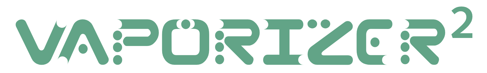
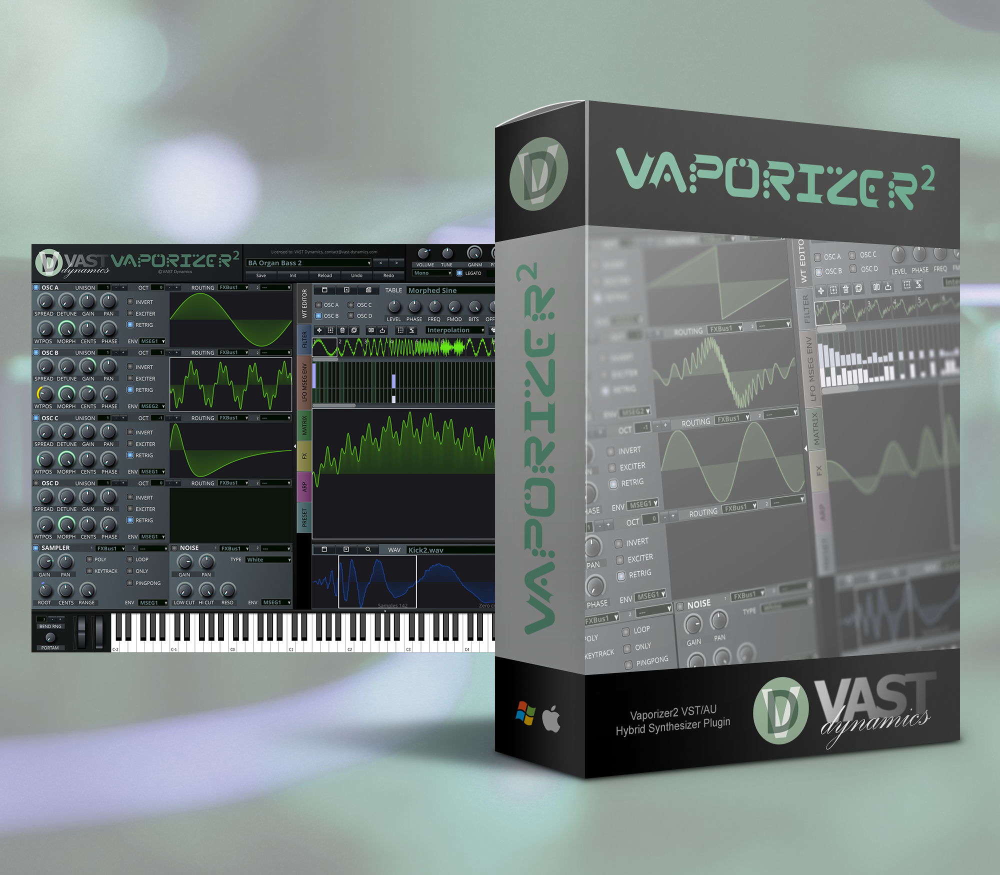

# Vaporizer2


 
"PROBABLY THE MOST VERSATILE WAVETABLE SYNTHESIZER"  
Vaporizer2 is a hybrid wavetable additive / subtractive VST / AU / AAX / CLAP/ LV2 synthesizer / sampler workstation.  

The heart of this plugin is the alias-free versatile high-performance wavetable sound engine with low system CPU resource usage.  

Vaporizer2 comes with a groundbreaking wavetable editor with a vast number of editing possibilities including frequency shift, smooth, clean, bend and bloat for single-cycles, parts of single-cycles or even whole wavetables.
Featuring an easy-to use wavetable draw mode with smooth Bezier curves and snap to grid function.

Available formats: VST2 / VST3 / AU / AAX / LV2 plugins and a standalone version for macOS, Linux and Windows.

* Vaporizer2 was developed by VAST Dynamics GbR between 2017 and 2023 and is now free software under GPL3 license.  
* Vaporizer2 is based on the [JUCE framework](https://github.com/juce-framework/JUCE) under GPL3 license.  
* Vaporizer2 ueses either [muFFT](https://github.com/Themaister/muFFT/tree/master) or [FFTW3](https://github.com/FFTW/fftw3) under GPL2 license. Usage can be comtrolled with build parameters VAST_FFT_MUFFT or VAST_FFT_FFTW3.
* You need a (free) developer license from [Steinberg](https://www.steinberg.net/de/developers/) to use the VST2 SDK (to build a .vst instead of .vst3).  In that case put the SDK in the VST_SDK folder.
* You need a (free) ASIO SDK 2.3 installation from [Steinberg](https://www.steinberg.net/de/developers/). Place it in the asiosdk folder.  
* You need a (free) developer license from [Avid Technology](http://developer.avid.com/aax/) to use the AAX SDK (to build an AAX plugin for ProTools). In that case put the SDK in the AAX_SDK folder. The compiled AAXLibrary_x64.lib is expected here C:\Vaporizer2\AAX_SDK\aax-sdk-2-6-0\Libs\Release\AAXLibrary_x64.lib. You can change the folder in the global path settings of the Projucer.
* Code signing and notarization is required to build an AAX or an AU on MacOS. The process is not described here.
* To the best of our knowledge the true type fonts in [VASTvaporizer/Resources/Fonts/](VASTvaporizer/Resources/Fonts/) are freeware and can be distributed. 

## Donation to support the project 
[](https://www.paypal.com/cgi-bin/webscr?cmd=_s-xclick&hosted_button_id=5H8QH4AU6UWWC)
   
[](https://www.paypal.com/cgi-bin/webscr?cmd=_s-xclick&hosted_button_id=5H8QH4AU6UWWC)

## Preparation for a CMAKE build (Projcuer .jucer file is distributed but not recommended, you need to have CMake and Ninja installed)
Create a suitable local project folder and cd into it.
```
git clone https://github.com/VASTDynamics/Vaporizer2.git
cd Vaporizer2
git submodule update --init --recursive
```

### 1. Windows
```
build_win.bat
```
   
### 2. macOS
```
./build_macos.sh
```

### 3. Linux
```
./build_linux.sh
```

### System-wide JUCE installed
If you have JUCE installed system-wide than you can pass 
```
-DUSE_SYSTEM_JUCE=ON
```
 to cmake. If JUCE's cmake modules are placed in some non-standard directory add 
```
-DCMAKE_PREFIX_PATH=/path/to/juce/cmake_dir
```

## Screenshot



Find more about the plug-in [here](https://www.vast-dynamics.com/?q=Vaporizer2).

## Demo Music
- [Demo songs of KVR One Synth Challenge 178 Vaporizer2 by VAST Dynamics (Soundcloud)](https://soundcloud.com/vast-dynamics/sets/vaporizer2-kvr-one-synth)
- [Vaporizer2 Demo songs (Soundcloud)](https://soundcloud.com/vast-dynamics/sets/vaporizer2-demo-tracks)

## Download installers

You can download installers for Windows and macOS with the built and packaged plug-ins [here](https://vast-dynamics.com/?q=products).
Prebuild packages and installers are also available [here on GitHub] (https://github.com/VASTDynamics/Vaporizer2/releases).

## Plug-in features
- Includes 780+ wavetables and single cycles and 450+ factory presets.
- State-of the art wavetable engine with four independent alias-free wavetable oscillator banks with up to 24 oscillator unison
- Can freely combine and modulate additive / FM / subtractive / wavetable / sampler sound generation types
- Vaporizer2 features a comprehensive preset management system with tags, free text search, file system folder management and ratings.
- Low system CPU resource usage - even with more than 1.000 oscillators playing
- All parameter knobs / sliders automatable and support manual editing for exact parameter values
- State of the art preset management system with tags, free text search, file system folder management and ratings
- Comes with a rapdily growing number of presets – freely available on the website and GitHub
- Plus: the sound is stunning!
### Oscillators, polyphony, MPE and aftertouch
- Mono legato mode or polyphonic 4 / 16 / 32(!) voice modes
- Support for MIDI Polyphonic Expression (MPE): receive MPE MIDI dimensions (X/Y/Z) pitchbend, aftertouch (freely assignable), release velocity / lift (controlled via MSEG) and brightness / timbre (freely assignable) form supported controllers for highly expressive control options
- Intelligent polyphonic portamento / glissando (you need to hear it!)
- Support for polyphonic aftertouch
- Oscillator pitch modulation and phase modulation with very fast modulations (up to ~ 2kHz)
- Microtuning support (AnaMark Tuning files .TUN support)
### Wavetable engine
- Unique architecture allowing to freely change and even exchange / load wavetables while playing without aliasing
- Engine vectorized with CPU-specific intrinsics for highest performance (SSE2/3, AVX, Neon)
- 30 real-time wavetable effects per oscillator including innovative algorithms for hard sync, sincify, brew and bend / bloat
- FM synthesis up to a chain of 4 oscillators
- General setting of wavetable frequency characteristics: sharp (ideal filtering), soft (butterworth filtering), dull (linear) 
### Wavetable editor
- Groundbreaking wavetable editor with a vast number of editing possibilities including frequency shift, smooth, clean, bend and bloat for single-cycles, parts of single-cycles or even whole wavetables
- Easy-to use wavetable draw mode with smooth Bezier curves and snap to grid function
- Mix-in, amplitude modulate, interpolate, convolute, time>frequency, frequency>time or normalize wavetable cycles
- Generate FM, PWM, harmonic morphed / reduced, low pass / high pass / band pass / comb / formant filtering and even hard sync wavetables out of an arbitrary single cycle waveform 
- Morphing and phase shifting of wavetable cycles
- Import and change standard (Serum, Icarus) format wavetables - also simply via drag and drop
- Record single cycle changes into a new wavetable 
- Additive synthesis section that allows to freely edit all harmonics and phases in real-time
### Sampler
- Sampler section (wav / aiff / ogg / mp3) with loop points, loop start modulation, zero crossing detection and key tracking
- Granular synthesis mode in the sampler section for stunning ambient effects
- Resample samples to wavetables with pitch detection
### Effects
- Three effects busses including 4 x oversampling and mono cutoff to preserve a clean low end
- 11+ highly parameterizable effects including reverb, delay, chorus, flanger, bitcrush, eq, compressor, limiter, flanger, phaser, comb filter, waveshaper and more
- All effect times and durations can be synced to DAW
### Filters
- State of the art filter section (30+ different types) with 4 x oversampled LPF (biquad, state variable and diode ladder implementations) plus high pass, all pass, band pass, notch, shelf, comb and scream filters - all with resonance
- Very steep filter curves for punchy basses
- Real-time filter response display
### Modulation matrix
- Comprehensive modulation system with powerful modulation matrix including graphical display of modulation curves
- 25 modulation sources including key track, random drift and four custom macro knobs
- 220(!) modulation destinations (modulatable parameters) for almost unlimited modulation combinations
- Innovative audio routing system for all sound generators, filters and effect busses
### LFOs and MSEGs
- Five freely editable MSEG envelopes with loop function and DAW timecode sync
- Five LFOs (per voice - means up to 80 LFOs in total) with smooth generation optimized for lowest frequencies with ramp and phase that can be set per voice or global - can be synced to the DAW
### Arpeggiator and Step Sequencers
- Built-in arpeggiator that is freely editable and supports polyphonic modes, hold and midi file drag and drop and can be synced to the DAW
- Three step sequencers that can be synced to the DAW
### Plug-in editor user interface
- Easy to use and intuitive user interface that is freely scalable and resizable even up to 4k and more with many drag and drop features and many graphical components, e.g. audio-out oscilloscope, filter response, MSEG / LFO / ARP
- Polyphonic real-time visualization of parameter modulations
- Four different UI themes to choose from allowing for different contrasts and look-and-feel
- Hotkeys for most important editor functions
### Available platforms and formats
- Available formats: VST2 / VST3 / AU / AAX / CLAP / LV2 plugins and a standalone version
- Available platforms (64-bit): macOS (native Mac M1/M2 silicon support with neon vector extensions), Windows and Linux
- 32-bit plug-ins can be build with CMake if needed
### Minimum system requirements
- Any CPU that supports AVX or SSE2 (Intel, AMD or arm)
- 1GB RAM
- Windows 8/10 (32/64bit)
- macOS 10.13 or above
- Linux
- VSTi / AU / AAX / LV2 compatible Host software (32bit and 64bit).
